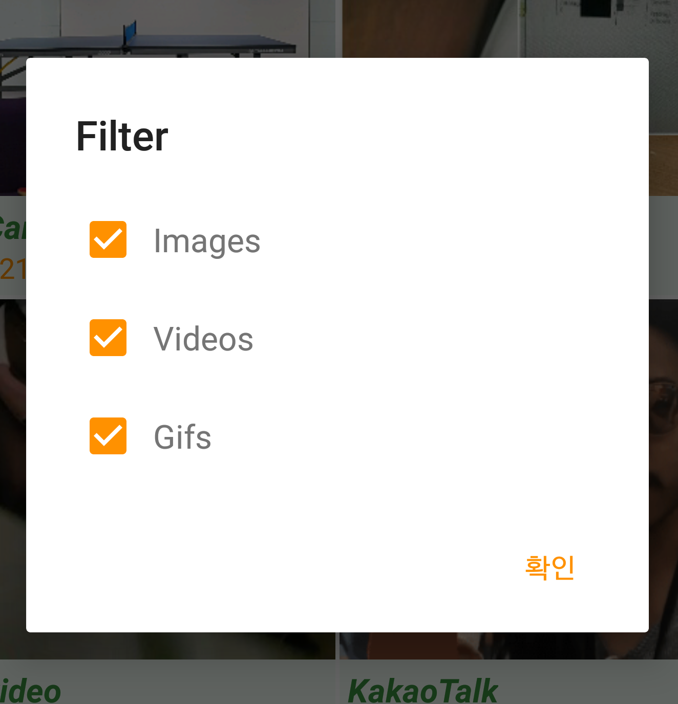
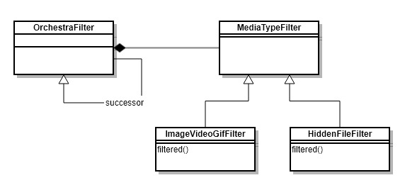
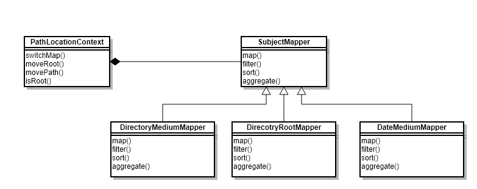
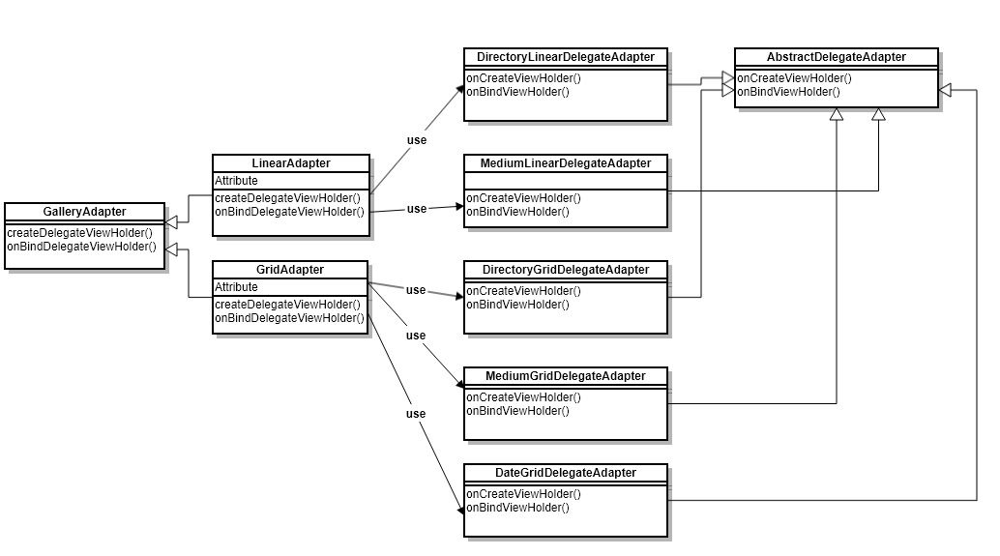
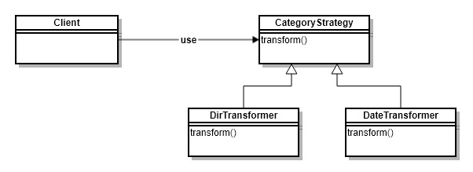
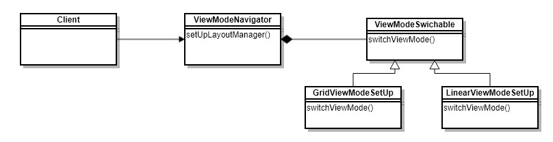

# CleanGallery
Gallery라는 주제로 Clean Code를 지향하며 Architecture를 보다 나은 방향으로 학습하기 위한 용도의 프로젝트입니다.


> Source는 99% [Kotlin](https://kotlinlang.org/)으로 작성되었습니다.  Unit Test는 100% [Kotlin-Spek](https://github.com/spekframework/spek)으로 작성되었습니다.

## Languages, libraries and tools used

* [Kotlin](https://kotlinlang.org/)
* Android Support Libraries
* [RxJava2](https://github.com/ReactiveX/RxJava/wiki/What's-different-in-2.0)
* [Dagger 2 (2.11)](https://github.com/google/dagger)
* [Glide (4)](https://github.com/bumptech/glide)
* [Gson](https://github.com/google/gson)
* [Timber](https://github.com/JakeWharton/timber)
* [Mockito](http://site.mockito.org/)
* [Spek](https://github.com/spekframework/spek)

## Data Sequential flow


### DataStore & Filter
DataStore 에서 Media들을 가져오기 위해서 [MediaFetcher][MediaFetcher]를 사용합니다.

MediaFetcher는 [ImageVideoGifFilter][ImageVideoGifFilter], [HiddenFileFilter][HiddenFileFilter]를 통해서 정해진 Media type [Image, Video, Gif]이거나 혹은 Hidden file를 제외하고 가져옵니다.


### Cache
매번 DataStore를 조회하는 것은 성능 저하가 심하기 때문에 [LocalDataSource][LocalDataSource]를 통해서 Media들을 **Cache** 합니다.
```kotlin
   private fun fetch(): Flowable<List<Medium>> {
        return Flowable
                .defer {
                    Timber.d("GalleryPresenter noMedia")
                    val cur = noMediaFolderProvider.query()
                    Flowable.just(noMediaFolderProvider.parseCursor(cur))
                }
                .map { noMediaFolder ->
                    Timber.d("GalleryPresenter getGalleries")
                    val cursor = mediaFetcher.query(getExternalStorageDirectory())
                    mediaFetcher.parseCursor(cursor, noMediaFolder)
                }
                .cache()
    }

    fun getGalleries(cacheInvalidate: Boolean): Flowable<List<Medium>> {
        return if (cacheInvalidate) {
            flowableCache = fetch()
            flowableCache!!
        } else {
            if (flowableCache == null)
                flowableCache = fetch()
            flowableCache!!
        }
    }
```

### Map & Filter & Sort & Aggregate
[GalleryRepository][GalleryRepository]는 [LocalDataSource][LocalDataSource]로 부터 전달받은 Media들을  `switchMap`를 사용하여 분류하는 역할을 합니다.
```kotlin
fun getGalleries(pathLocationContext: PathLocationContext, cacheInvalidate: Boolean): Flowable<List<Basic>> {
        return localDataSource.getGalleries(cacheInvalidate)
                .switchMap {
                    Flowable.just(pathLocationContext.switchMap(it))
                }
    }
```

[SubjectMapper][SubjectMapper]는  DirectoryRoot, DirectoryMedium, DateMedium 3가지의 Type으로 분류하고 있습니다.

`allInOne`를 호출하여 정의되어 있는 Type으로 작업을 수행합니다.
```kotlin
fun allInOne(
            curPath: String,
            imageVideoGifFilter: ImageVideoGifFilter,
            filterBit: Long, sortOption: SortOptions,
            items: List<T>
    ): List<R> {
        return items.let {
            map(it, { curPath })
        }.let {
            filter(it, { medium -> imageVideoGifFilter.filterd(medium, filterBit) == NOT_FILTERED })
        }.let {
            sort(it, { sortOption })
        }.let {
            aggregate(it, { sortOption })
        }
    }
```
## UI
[GalleryPresenter][GalleryPresenter]는 [GalleryRepository][GalleryRepository]로 부터 전달받은 Media 들을 UI로 전달합니다.
```kotlin
subscribe(
   { next ->
   val adapter = activity.getCurrentAdapter() ?: throw NullPointerException("adapter is null")
   val diffUtil = adapter.calculateDiff(next)
   adapter.updateByDiff(diffUtil)
   })
```

## Architecture


### User Interface
[MainActivity](https://github.com/kimtaesu/CleanGallery/blob/master/app/src/main/java/com/hucet/clean/gallery/activity/MainActivity.kt)에서 표시 할 UI 구성 요소를 만드는 데 사용됩니다. [GalleryPresenter](https://github.com/kimtaesu/CleanGallery/blob/master/app/src/main/java/com/hucet/clean/gallery/presenter/GalleryPresenter.kt) 를 사용하여 Media 데이터를 가져올 수 있습니다.

### Presentation
이 Layer는 UI를 표현하는데 사용되지만, 동시에 UI 자체에 대해서는 알지 못합니다. 즉, 안드로이드 프레임 워크에 의존하지 않기 때문에 Test 환경을 쉽게 구성할 수 있습니다.  [GalleryRepository](https://github.com/kimtaesu/CleanGallery/blob/master/app/src/main/java/com/hucet/clean/gallery/repository/GalleryRepository.kt)를 사용하여 Media 데이터를 가져올 수 있습니다.

### Data
Data Layer는 여러 External data layer 대한 **Access Point**입니다. 현재는 Local data layer만 구현되어 있으며, 추후 요구사항에 따라 여러 Cache, Network data source로 부터 데이터를 가져오는 데 사용됩니다.

> Data layer의 추상화는 _Over Engineering_ 일 수 있습니다. Data layer는 **저 수준이기 때문에 Data Layer의 변경은 고 수준(UI, Presentation) 범위를 포함될 수 있습니다.** 또한 실제 문제가 뒤 늦게 나타날 수도 있으며, 시간이 길어질 수록 그동안 구현한 코드를 변경하는 것이 어려울 수 있습니다.

### Local
Local Layer는 [MediaFetcher](https://github.com/kimtaesu/CleanGallery/blob/master/app/src/main/java/com/hucet/clean/gallery/datasource/local/MediaFetcher.kt)를 사용하여 데이터를 가져올 수 있습니다. MediaFetcher는 [ContentResolver](https://developer.android.com/reference/android/content/ContentResolver.html)의 Query를 통해 Local의 저장되어 있는 Image, Video, Gif를 가져옵니다.

## Design Patterns
### MediaFilter (Chain of responsibility)



 * [ImageVideoGifFilter][ImageVideoGifFilter]는 Media type [Image, Video, Gif]을 filter 합니다.
 * [HiddenFileFilter][HiddenFileFilter]는 Hidden file을 filter 합니다.



### MediaFilter (State)

CleanGallery의 Category는 [Directory, Date]로 구성되어 있습니다.
또, Directory 구조에서 [Root, Medium] 으로 구분하고 있습니다.


이 부분의 구조가 처음부터 잘못되어 있다면, 유지보수 하는 내내 if ~ else 가 남발될 수 있는 상황을 초래할 수 있습니다.

그래서 State Pattern을 사용하였습니다.



 * [PathLocationContext][PathLocationContext]는 `isRoot` 상태를 확인하며, `switchMap`을 통해 적절한 Type으로 Mapping 합니다.
 * [SubjectMapper][SubjectMapper]는 [DirectoryMediumMapper, DirecotryRootMapper, DateMediumMapper]의 Mapper type으로 `map`, `filter`, `sort`, `aggregate`를 수행합니다.

### Adapter Delegation (Adapter)
아래의 UML이 복잡하게 보이지만 간단합니다.
* Target : GalleryAdapter
* Adapter : LinearAdapter, GridAdapter
* Adaptee : DirectoryLinearDelegateAdapter, MediumLinearDelegateAdapter, DirectoryGridDelegateAdapter, MediumGridDelegateAdapter, DateGridDelegateAdapter

만약 이 요구사항을 하나의 Adapter에서 if ~ else문으로 해결해야 했다면, 많은 문제를 극복해야 했습니다.
* 동적으로 LayoutParam 수정
* Linear, Grid의 View 차이점
* etc...

Adapter 패턴으로 구조를 잡음으로써 **각 Class는 하나의 책임을 가지게 됩니다.** 즉, 다른 변경 사항의 영향을 받지 않습니다.




### Transformer (Strategy)
위에서 설명한대로 CleanGallery의 Category는 [Directory, Date]로 구성되어 있습니다.

[DateTransformer][DateTransformer], [DirTransformer][DirTransformer] 는 Date, Direcotry 각각의 요소로  Groupping 을 수행합니다.

> 용어 혼동의 우려로 aggregate와 Transformer의 Naming 이유를 설명드리도록 하겠습니다.
 * aggregate : `SubjectMapper` 관점에서 Naming
 * Transformer : `DateTransformer`, `DateTransformer` 관점에서 Naming



### SetUp View Mode (Strategy)

[Linear, Grid] 두 가지 Type의 User Interface의 요구사항이 있었습니다.  이것를 **ViewMode**라고 명칭을 정했습니다.

Client의 요청에 의해 ViewMode [Linear, Grid]에 따라서 User Interface가 표현됩니다.




 [MediaFetcher]: app/src/main/java/com/hucet/clean/gallery/datasource/local/MediaFetcher.kt
 [ImageVideoGifFilter]: app/src/main/java/com/hucet/clean/gallery/gallery/filter/ImageVideoGifFilter.kt
 [HiddenFileFilter]: app/src/main/java/com/hucet/clean/gallery/gallery/filter/HiddenFileFilter.kt
 [LocalDataSource]: app/src/main/java/com/hucet/clean/gallery/datasource/local/LocalDataSource.kt
 [SubjectMapper]: app/src/main/java/com/hucet/clean/gallery/gallery/directory/SubjectMapper.kt
 [GalleryPresenter]: app/src/main/java/com/hucet/clean/gallery/presenter/GalleryPresenter.kt
 [GalleryRepository]: app/src/main/java/com/hucet/clean/gallery/repository/GalleryRepository.kt
 [DateTransformer]: app/src/main/java/com/hucet/clean/gallery/gallery/category/DateTransformer.kt
 [DirTransformer]: app/src/main/java/com/hucet/clean/gallery/gallery/directory/DirTransformer.kt
